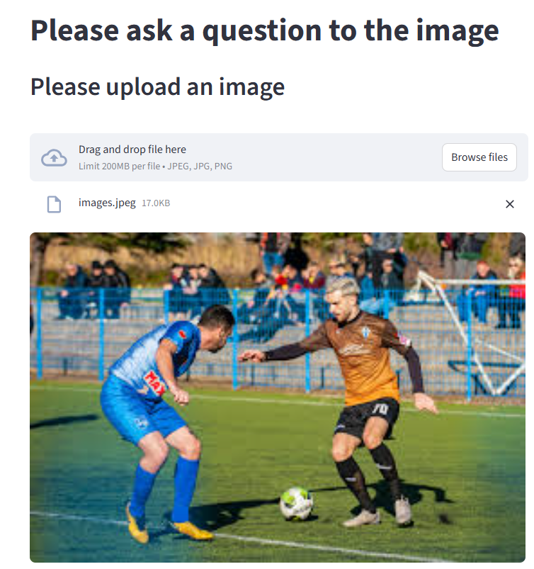

# 📸 Images That Talk  
**Image Understanding with Vision Models + LLM Reasoning**

---

## 📌 Overview

**Images That Talk** is a Streamlit-based computer vision application that allows users to upload an image and ask natural-language questions about it.

The system combines **local vision models** (for image understanding) with a **free large language model (Groq)** for reasoning and tool selection. All image processing is performed locally, making the project **cost-free**, **efficient**, and **reproducible**.

---

## 🧠 System Architecture

The application follows a tool-based reasoning pipeline:

1. User uploads an image through the Streamlit interface  
2. Vision tools analyze the image:
   - Image captioning (BLIP)
   - Object detection (DETR)
3. A language model (Groq – LLaMA 3) decides which tool to use  
4. The final answer is generated and displayed

> The LLM does **not** directly see the image — it reasons over structured outputs from vision tools.

---

## 🖼️ Architecture Diagram


---

## 🛠️ Tools & Models

### 🔹 Image Captioning
- **Model**: `Salesforce/blip-image-captioning-large`
- **Framework**: HuggingFace Transformers
- **Purpose**: Generate a natural-language description of the image

### 🔹 Object Detection
- **Model**: `facebook/detr-resnet-50`
- **Framework**: HuggingFace Transformers
- **Purpose**: Detect objects and return bounding boxes, class labels, and confidence scores

### 🔹 Language Model (Free)
- **Provider**: Groq
- **Model**: `llama-3.1-8b-instant`
- **Role**: Reasoning, tool selection, response generation

---

## 🖥️ Application Interface




---

## 🚀 How to Run the Project

### Clone the Repository
```bash
git clone https://github.com/your-username/Images-that-Talk.git
cd Images-that-Talk

```

### Create and Activate a Virtual Environment

Windows

```bash

python -m venv venv
venv\Scripts\activate

```

Mac / Linux

```bash
python3 -m venv venv
source venv/bin/activate
```


### Install Dependencies

```bash
pip install -r requirements.txt
```


### Set Up Groq API Key (Free)

Create an account at:
https://console.groq.com/

Set your API key as an environment variable.

Windows (PowerShell)
```bash
setx GROQ_API_KEY "gsk-xxxxxxxxxxxxxxxx"
```

Mac / Linux

```bash
export GROQ_API_KEY="gsk-xxxxxxxxxxxxxxxx"
```

Restart your terminal after setting the key.

### Run the Streamlit Application
streamlit run main.py

## 📖 How to Use

1. Upload an image (`.jpg`, `.jpeg`, `.png)
2. Ask a question such as:
   - “Describe this image”
   - “What objects are present?”
   - “Is there a person in the image?”
3. The agent selects the appropriate vision tool and returns a response
